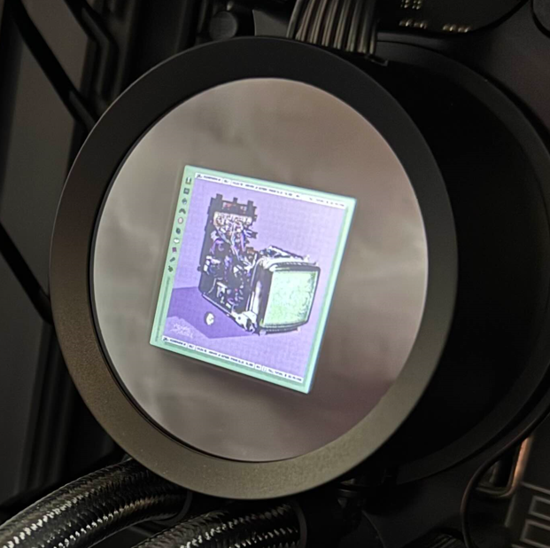

# Kraken Spotify Web Integration

It displays the cover of the currently playing album from Spotify on the LCD of a water-cooled cooler other than the Kraken Elite model.



## Setup

1. Open [NZXT CAM](https://nzxt.com/software/cam)
2. Lighting -> LCD Display -> Web Integration
3. Custom Web Integration -> Paste [https://kraken.solo.moe](https://kraken.solo.moe) -> Apply -> Configure -> Add as Card
4. Enjoy!

## Self Hosting

You need to change the following items in [App.tsx](./src/App.tsx):

```tsx
const clientId = '<YOUR_CLIENT_ID>';
const redirectUri = 'http://localhost:5173';
```
